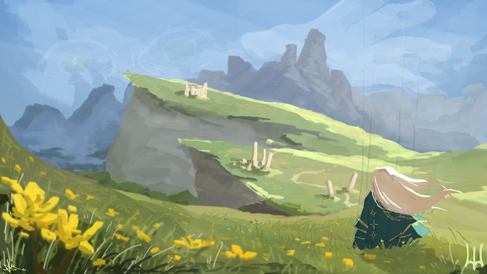

# pilott

C++ developer focused on internal and external development, anti-cheat research, and cheat development.

## about

I mainly work in C++ and spend most of my time learning more about game security, anti-cheat systems, reverse engineering, and low-level development.

Most of my projects are private, but I occasionally release tools, experiments, and other work here.

## skills

* C++
* internal development
* external development
* reverse engineering
* anti-cheat research
* Windows development
* debugging

## tools

* Claude
* GitHub
* Discord
* Visual Studio
* developer forums and communities

## contact

The best way to reach me is through Discord.

thanks for checking out my profile.

